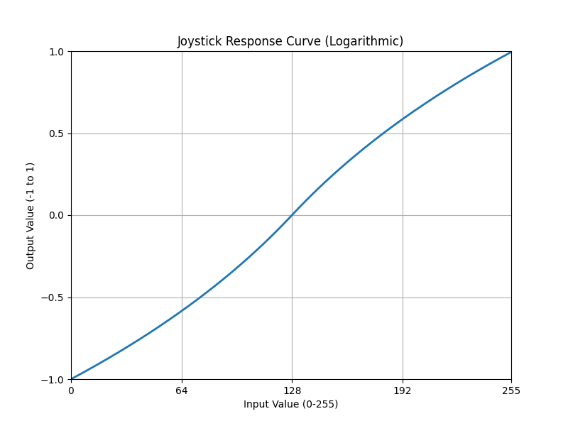

# Smart Stick Py

Smart Stick Py is an application that allows you to decode DualShock4 input at a low level, freely modify the input, and output it as XINPUT. This application provides granular control over the input modification process, enabling you to customize the behavior of your DualShock4 controller.

## Dependencies

- Windows OS
- Python 3.11
- ViGEm (Virtual Gamepad Emulation Framework)

## Recommended Additional Library

- HidHide (Hides input devices from applications)

## Installation

1. Install ViGEm:

   - Download the latest version of ViGEm from the [official website](https://vigembusdriver.com/).
   - Run the installer and follow the installation instructions.

2. (Optional) Install HidHide:

   - Download the latest version of HidHide from the [official GitHub repository](https://github.com/ViGEm/HidHide/releases).
   - Run the installer and follow the installation instructions.

3. Clone the repository:

   ```
   git clone https://github.com/your-username/smart-stick-py.git
   ```

4. Create a virtual environment:

   ```
   python -m venv .venv
   ```

5. Activate the virtual environment:

   ```
   .venv\Scripts\activate
   ```

6. Install the required dependencies:

   ```
   pip install -r requirements.txt
   ```

7. Run the application:
   ```
   python src/main.py
   ```

## Usage

### Modifying Input

To modify the input behavior, you can edit the `src/handler.py` file. This file contains the logic for handling and modifying the input from the DualShock4 controller before it is output as XINPUT.

### Adjusting Stick Response Curve

If you want to adjust the response curve of the joystick, you can modify the `normalize_joystick` function in the `src/response_curve.py` file. This function determines how the joystick input is mapped to the output values.

### Visualizing Response Curve

To visualize the response curve, run the following command:

```
python src/response_curve.py
```

This will display a graphical representation of the current response curve, allowing you to see how the input values are mapped to the output.



## Contributing

Contributions to Smart Stick Py are welcome! If you find any issues or have suggestions for improvements, please open an issue or submit a pull request on the GitHub repository.

## License

This project is licensed under the [MIT License](LICENSE).
